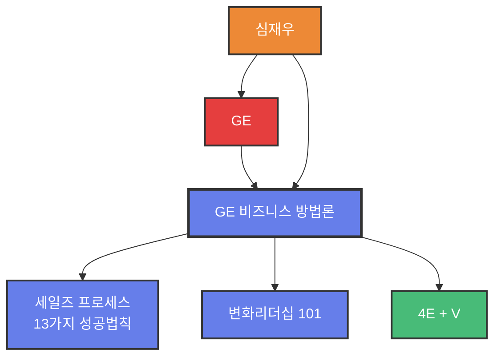

# GE 비즈니스 방법론

## 1. 한 줄 정의
General Electric(GE)에서 15년간 축적된 세일즈, 변화관리, 인재육성 비즈니스 방법론 체계

## 2. 핵심 요약
GE는 세계에서 가장 강한 조직으로 알려진 기업이며, 잭 웰치(Jack Welch) 회장의 리더십 아래 구축된 체계적인 비즈니스 프로세스를 보유하고 있습니다.

주요 구성 요소:
- **세일즈 프로세스**: 13가지 성공법칙
- **변화 리더십 101**: 9가지 핵심 리더십 자질
- **인재 육성**: 4E + V 모델
- **비즈니스 역량**: Threshold of Competency

## 3. 주요 구성 요소

### 3.1 GE 세일즈 기술
- 보스를 매니징 하라 (Boss Managing)
- 고객을 매니징 하라 (Customer Managing)
- 비즈니스 성공 비결
- 역량의 반감기 (Half Time of Competency)
- GE Global 미팅 문화

### 3.2 GE 변화 리더십
**9가지 핵심 리더십:**
1. Energize & Growth (동기부여와 성장)
2. Vision Maker (비전 메이커)
3. Energy & Positive Thinking (에너지와 긍정적 사고)
4. Integrity (도덕성)
5. Edge (결단력)
6. Communication (커뮤니케이션)
7. Execute & Risk-Taking (실행과 위험 감수)
8. Sharing & Celebration (공유와 축하)
9. Excellence & Competency (탁월함과 역량)

### 3.3 GE 인재 육성 모델
**4E + V:**
- Energy (에너지)
- Energize (동기부여)
- Edge (결단력)
- Execute (실행력)
- Values (가치)

**교육 프로그램:**
- Executive Program (경영진)
- Advanced Manager Program (고급관리자)
- Professional Skill Program (전문가)

## 4. 관련 문제
- 한국 기업의 위치가 그간 과거와 달라졌지만 본질적인 역량 격차는 여전히 존재
- 핵심인재들의 행실을 못봄
- 최고의 전문가 못봄
- 인재양성이 충요하다고 말하나 체계가 없음

## 5. 해결 방식
- GE가 이명게 최두당 기업이 되었는지, GE의 핵심인재들은 어떤 역량과 노하우를 배우고 가지고 있는지를 학습
- 내가 직접 경험한 세일즈 사례와 노하우를 서술
- 프로들이 사용하는 절문기술을 이명게 활용하는지 실무 예시 제공

## 6. 활용 가능 산출물
- 세일즈 교육 프로그램
- 변화관리 워크숍
- 리더십 개발 과정
- 인재 육성 체계 설계
- 조직 역량 진단 도구

## 7. 연결 노트
- [[잭웰치]]
- [[세일즈 프로세스 13가지 성공법칙]]
- [[변화 리더십 101]]
- [[GE 인재육성 모델]]
- [[4E + V]]
- [[Boss Managing]]
- [[Customer Managing]]

## 8. 원본 출처
- 파일명: 서적 4 - GE의 세일즈 노트.pdf
- 위치: C:\000 자료 모음\09 심재우 저서
- 파일명: 서적 5 - GE의 변화리더십 101.pdf
- 위치: C:\000 자료 모음\09 심재우 저서

## 9. 저자 정보
**심재우 (Jai-Woo Shim)**
- General Electric(GE) 글로벌 비즈니스 역량 전문가
- 마케팅, 세일즈, 기획, 기술, 교육, 프로젝트 매니징 경력
- BBC(Biz Book Writers' Club) 정회원
- 아주대학교 '자기계발' 초빙강사
- 'SB 컨설팅' 대표컨설턴트

## 10. 온톨로지 그래프

**노드 설명:**
- 🔵 **Methodology**: GE 비즈니스 방법론, 세일즈, 변화리더십
- 🟢 **Concept**: 4E + V
- 🔴 **Company**: GE
- 🟠 **Person**: 심재우

**관계 설명:**
- GE 비즈니스 방법론은 3대 방법론을 포함
- GE가 이 방법론을 생산
- 심재우 저자가 GE 경험을 바탕으로 창작
