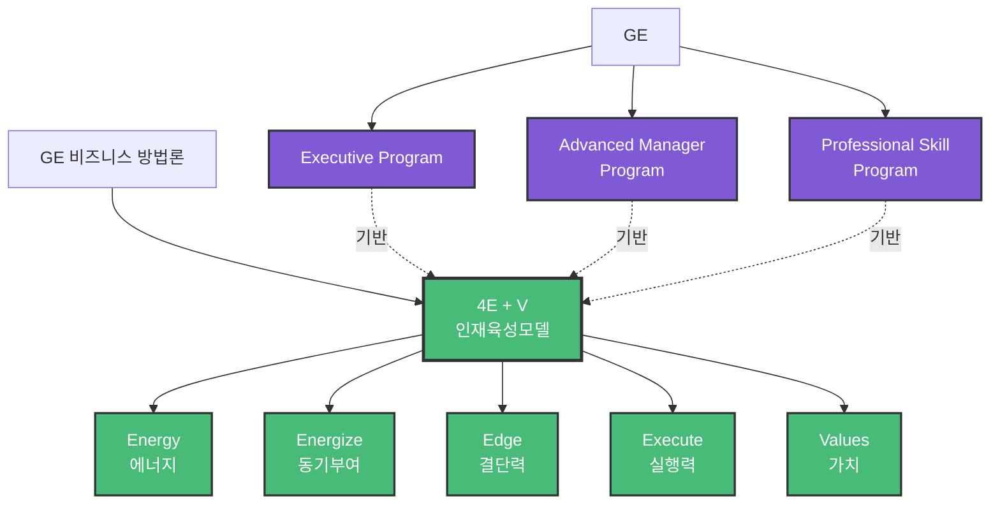

# 4E + V 인재육성 모델

## 1. 한 줄 정의
GE의 인재 선발 및 육성 핵심 역량 모델 - 4가지 E와 1가지 V로 구성

## 2. 핵심 요약
GE가 수퍼급 인재를 만들기 위해 사용하는 핵심 역량 프레임워크입니다.

**4E + V 구성:**
- **Energy** (에너지): 개인의 열정과 추진력
- **Energize** (동기부여): 타인에게 에너지를 전달하는 능력
- **Edge** (결단력): 어려운 결정을 내리는 용기
- **Execute** (실행력): 계획을 실제 성과로 전환하는 능력
- **Values** (가치): 조직의 핵심 가치 체화

## 3. 주요 구성 요소

### Energy (에너지)
- 개인의 열정
- 추진력
- 지속적인 에너지 수준 유지

### Energize (동기부여)
- 팀원들에게 영감을 주는 능력
- 타인을 움직이는 힘
- 조직 전체에 긍정적 에너지 전파

### Edge (결단력)
- 어려운 의사결정 능력
- 흑백논리가 아닌 상황 판단력
- 결정의 용기

### Execute (실행력)
- 계획을 행동으로 옮기는 능력
- 성과 창출 능력
- 목표 달성 집중력

### Values (가치)
- 조직의 핵심 가치 이해
- 가치에 기반한 행동
- 윤리적 판단력

## 4. 관련 문제
- 단순 스펙이나 학력만으로는 진정한 인재를 판별하기 어려움
- 역량 중심의 체계적인 인재 선발 기준 부재
- 인재 육성의 명확한 방향성 부족

## 5. 해결 방식
GE는 4E + V 모델을 통해:
- 인재 선발 시 명확한 기준 제시
- 교육 프로그램 설계의 기반으로 활용
- 성과 평가 및 승진 기준으로 적용
- 리더십 개발의 핵심 프레임워크로 사용

## 6. 활용 가능 산출물
- 인재 선발 체크리스트
- 역량 진단 도구
- 리더십 개발 프로그램
- 성과 평가 기준표
- 교육 커리큘럼 설계 가이드

## 7. 연결 노트
- [[GE 비즈니스 방법론]]
- [[GE 인재육성 시스템]]
- [[잭웰치]]
- [[Executive Program]]
- [[Advanced Manager Program]]
- [[Professional Skill Program]]
- [[역량 기반 인재관리]]

## 8. 원본 출처
- 파일명: 서적8-GE는 어떻게 수퍼급 인재를 만드는가.pdf
- 위치: page 4-5
- 추출 단위: F004-C005

## 9. 검토 필요 사항
- 각 E와 V에 대한 구체적 측정 지표 추가 필요
- 3단계 교육 프로그램(Executive/Advanced/Professional)과의 연계 구조 명확화 필요

## 10. 온톨로지 그래프

**노드 설명:**
- 🟢 **Concept**: 4E + V와 5개 역량 요소
- 🟣 **Process**: 3단계 교육 프로그램

**4E + V 구성:**
1. **Energy** - 개인의 열정
2. **Energize** - 타인 동기부여
3. **Edge** - 결단력
4. **Execute** - 실행력
5. **Values** - 핵심 가치

**교육 체계:**
- Executive (경영진)
- Advanced Manager (고급관리자)
- Professional Skill (전문가)
