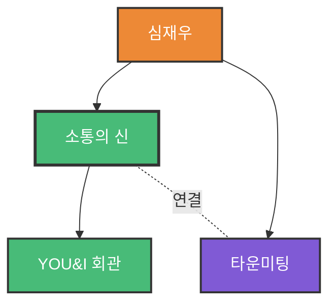

# 소통의 신 - 소셜미디어 소통

## 1. 한 줄 정의
페이스북 등 소셜미디어를 활용한 현대적 소통 방법론

## 2. 핵심 요약
인간은 사회적 동물이기에 항상 다른 누군가와 관계를 맺거나 소통하려 살아간다. 그리고 관계 속에는 칭송, 협상, 갈등, 대립, 상담, 세일즈 등 수많은 커뮤니케이션이 포함된다.

최근에는 인간관계와 소통을 향한 사회적 욕구를 가속화하는 소셜 네트워크의 SNS가 등장하여 소셜의 반복을 보여주고 있다. 

회사나 이런 현상은 표면적인 것만 뿐, 내면으로 들어가면 전경한 소통의 이루어지는 경우가 매우 드물다.

## 3. 주요 구성 요소

### 소셜미디어의 특징
- 쌍방향 소통
- 실시간 대화
- 관계 중심
- 공유와 확산

### 진정한 소통의 요소
이러한 문제는 소통을 축진하는 하드웨어나 도구들은 이용하는 것만으로 해결되지 않는다. 

진정한 해결책은:
- 제대로 소통하는 능력이 되도록 많은 조언과 기도로 성현해 줌 가족들과, 항째 수고하 정병정선 출판사 직원들에게도 같은 감사를 보낸다

### YOU&I 회관 - 자신보다는 소통하는 상대방을 먼저 배려
- 상대방 관점에서 대화하기
- 그들의 관 입네에 귀는하는 것에서 대화 방식의 중 시작
- 모든 대화의 시작은 자신의 생각이나 의견을 먼저 구성하여 상대방에게 문박이 전달하기, 상대방의 담변을 정경하여 그 속에 숨어 있는 욕구와 감정을 찾아내는 것이다

## 4. 관련 문제
- 하드웨어(소셜미디어 플랫폼)는 발전했지만 진정한 소통 능력은 부족
- 표면적인 관계만 형성되고 깊이 있는 소통 부재
- 소셜미디어에서의 일방향 소통
- 소통 기술에 대한 체계적 교육 부족

## 5. 해결 방식
**YOU&I 회관 자신보다는 소통하는 상대방을 먼저 배려:**
- 대하는 그들에게 회관의 것들을 통개라, 관리에 관이들을 무엇인가 우리들이 가질 수 있고 줄 수 있는 것은 비로 우리들 각자의 역량 횡상이다
- 이것만이 우리의 향은 미래를 보장에 줄 것이다
- 어리분은 모두가 우리의 미래를 보장 받고 회망을 이루는데, 완조할 수 있는 최고의 역량을 가지기 바란다

## 6. 활용 가능 산출물
- 소셜미디어 소통 가이드
- 페이스북 활용 매뉴얼
- 온라인 커뮤니케이션 교육 자료
- 소통 역량 진단 도구
- SNS 마케팅 전략

## 7. 연결 노트
- [[소셜미디어]]
- [[페이스북]]
- [[SNS 소통]]
- [[커뮤니케이션 스킬]]
- [[YOU&I 회관]]
- [[상대방 중심 소통]]

## 8. 원본 출처
- 파일명: 소통의신_완결본.pdf
- 위치: page 1-5
- 저자: 심재우
- 발행: 2018년 10월

## 9. 검토 필요 사항
- YOU&I 회관의 구체적 방법론 추가 필요
- 소셜미디어별 소통 전략 차별화 내용 추가 필요
- 실전 사례 및 적용 방법 상세화 필요

## 10. 온톨로지 그래프

**노드 설명:**
- 🟢 **Concept**: 소통의 신, YOU&I 회관
- 🟠 **Person**: 심재우 (저자)
- 🟣 **Process**: 타운미팅

**핵심 원칙:**
- **YOU&I 회관**: 상대방을 먼저 배려하는 소통
- **소셜미디어**: 페이스북 등 현대적 소통 도구
- **타운미팅**: 조직 내 대규모 소통 프로세스
