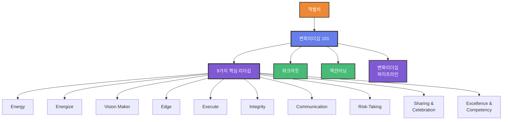

# 변화 리더십 101 (Change Leadership 101)

## 1. 한 줄 정의
GE의 변화 리더십 101 - 잭 웰치의 변화관리 방법론과 리더십 자질 체계

## 2. 핵심 요약
지금의 시대는 매우 빠르게 변화하고 있다. 그래서 우리들도 이러한 변화에 빠르게 적응되도록 요구 받고 있다.

특히, 조직이나 팀의 리더들은 누구보다 빠른 변화를 해야 한다. 그런데, 변화를 생각할 때, 가장 먼저 띠오르는 사람은 GE(General Electric)를 세계에서 가장 강한 조직으로 만든 책 웰치이다.

**1980년 GE의 회장으로 되면서, 당시 2류의 거대공동기업인 GE를 약 15년 만에 최우량기업으로 변화시켰다.** 책 웰치가 회장이 된 이후, 가장 역점을 두고 강조하고 수진한 것이 바로 변화(Change)였다.

## 3. 주요 구성 요소

### 3단계 변화 프로세스

#### 1부 - 내가 경험한 GE에서의 변화와 혁신
- 변화의 핵심
- GE 변화의 핵심, 위크아웃과 액션러닝
- GE의 변화리더십 파이프라인
- 변화리더십 파이프라인이 필요한 이론적 배경
- 변화리더십 파이프라인의 4가지 구성요소
- GE에서의 리더십
- 공유와 축하

#### 2부 - 책 웰치의 9가지 변화혁신 리더십
**9가지 핵심 리더십 자질:**

1. **Energize & Growth** (동기부여와 성장)
   - 리더십의 핵심은 동기부여

2. **Vision Maker** (비전 메이커)
   - 미래를 그리는 능력

3. **Energy & Positive Thinking** (에너지와 긍정적 사고)
   - 긍정적 태도와 열정

4. **Integrity** (도덕성)
   - 윤리와 신뢰

5. **Edge** (결단력)
   - 어려운 결정을 내리는 용기

6. **Communication** (커뮤니케이션)
   - 효과적인 소통 능력

7. **Execute & Risk-Taking** (실행과 위험 감수)
   - 실행력과 도전정신

8. **Sharing & Celebration** (공유와 축하)
   - 성과 공유와 인정 문화

9. **Excellence & Competency** (탁월함과 역량)
   - 지속적 역량 개발

#### 3부 - 변화혁신 리더들의 변화리더십 지도
- 첫 번째 변화리더 - 어맨장자 "스티브 스굿"의 변화리더십 지도
- 두 번째 변화리더 - 남극탐험가 "어니스트 새클턴"의 변화리더십 지도
- 세 번째 변화리더 - 미국의 정신적 지주 "맥가운 프랜클린"의 변화리더십 지도
- 성공리더들이 걸어간 변화리더십 지도의 발자취

## 4. 관련 문제
**지식의 목적과 성공 그리고 자기계발 등을 통하여 삶을 살고, 하나의 목표와 성공을 향하여 걸을 간다:**
- 성공을 향한 걸음 갈 때에도, 계속 장애물 등을 만나고, 측간에서 부딪는다
- 특히, 환란도 가보지 않았거나, 걸을 찾아가는 방법을 모른다면 어떡게 하는가?

**인생을 살면서 사람들은 지나다니 목표와 성공을 향하여 걸을 간다:**
- 성공을 향한 걸을 갈 때에도, 계속 장애물 등을 만나고, 측간에서 부딪는다
- 우리에게 길을 안내하는 '성공리더'는 우리가 원하는 '성공이나 성공으로 가는 걸을 갈 거에 우리에게 안내를 한다

## 5. 해결 방식
**변화 지도를 자기계발 등을 통하여:**
- 성공을 향한 걸은 목적지 도달을 목적으로 하는 경영대학 목적지가 가자 자신이 원하는 삶을 살 거이며, 자신이 좋아하는 점을 갈게 가기 위해여 부단한 노력과 노테력 인내를 하였다

**우리의 인생이나 삶과 관련하여 다양한 주재나 분야들이 있으며, 이것들 모두 우리들의 성공이나 꿈을 이루는데:**
- 필수적인 요소들이다
- 상공리더들은 이와 같은 법칙과 관련를 알고 실천하여, 인생에서 자신이 전경으로 꿈꾸 원하는 일을 찾았고, 계속하여 좋은 성과들을 얻고 있다

## 6. 활용 가능 산출물
- 변화관리 워크숍
- 리더십 개발 프로그램
- 조직 변화 로드맵
- 리더십 역량 진단 도구
- 변화 저항 관리 가이드
- 변화리더십 교육 과정

## 7. 연결 노트
- [[GE 비즈니스 방법론]]
- [[잭웰치]]
- [[위크아웃]]
- [[액션러닝]]
- [[변화리더십 파이프라인]]
- [[Estee Lauder]]
- [[변화리더십 지도]]

## 8. 원본 출처
- 파일명: 서적 5 - GE의  변화리더십 101.pdf
- 위치: page 1-5 및 목차
- 저자: 심재우
- 발행: 2005년 11월

## 9. 검토 필요 사항
- 위크아웃(WorkOut)의 상세 개념 추가 필요
- 액션러닝(Action Learning)의 상세 프로세스 추가 필요
- 변화리더십 파이프라인 4가지 구성요소 상세화 필요
- 3명의 변화리더 사례 상세 내용 추가 필요

## 10. 온톨로지 그래프

**노드 설명:**
- 🔵 **Methodology**: 변화리더십 101
- 🟠 **Person**: 잭웰치 (창시자)
- 🟣 **Framework**: 9가지 핵심 리더십, 파이프라인
- 🟢 **Concept**: 위크아웃, 액션러닝, 10개 리더십 자질

**9가지 핵심 리더십:**
1. Energy & Energize (에너지)
2. Vision Maker (비전)
3. Edge (결단력)
4. Execute (실행력)
5. Integrity (도덕성)
6. Communication (소통)
7. Risk-Taking (위험 감수)
8. Sharing & Celebration (공유와 축하)
9. Excellence & Competency (탁월함)
