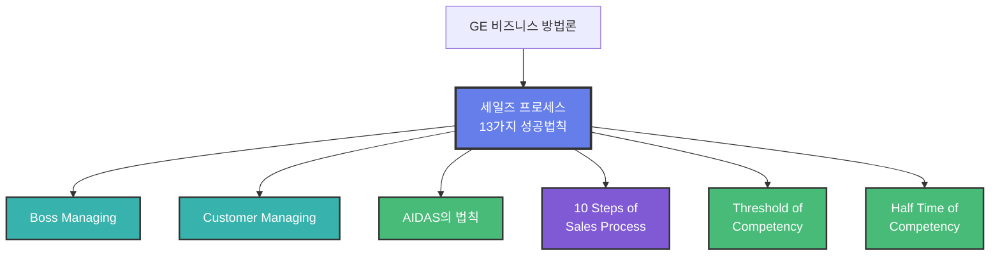

# 세일즈 프로세스 13가지 성공법칙

## 1. 한 줄 정의
GE 프로들이 사용하는 13가지 세일즈 성공 법칙 체계

## 2. 핵심 요약
이 책은 모두 6단원으로 구성되어 있습니다. "1. GE의 세일즈 기술"에서는 GE에서 근무하면서 배우고 경험했던 것들을 서술하였습니다. GE에 대하여 궁금했던 것들에 대한 이해가 될 것입니다.

## 3. 주요 구성 요소

### 법칙 1 - 고객을 중심에 두어라
고객 중심 사고의 중요성

### 법칙 2 - Push형이 되지 말고, Full형이 되어라
강압적 세일즈가 아닌 완전한 솔루션 제공

### 법칙 3 - 대형세일즈에서는 스토서의 역할이 매우 중요하다
대형 거래에서의 전략적 스토리텔링

### 법칙 4 - 세일즈맨이 판단할 해결책을 주지 말고, 고객이 원하는 니즈에 대한 해결책을 주어라
고객 니즈 기반 솔루션 제공

### 법칙 5 - 세일즈의 실패는 고객의 거절이 아니고, 세일즈맨의 포기에서 온다
지속성과 끈기의 중요성

### 법칙 6 - 고객을 만나는 횟수가 아니고, 상담의 질을 높여라
양보다 질 중심의 상담

### 법칙 7-13
(추가 법칙들은 원문에서 상세히 다룸)

## 4. 관련 문제
- 한국의 많은 CEO와 리더들, 그리고 부들의 사람들이 GE와 책 웰치를 배우러 하나, GE가 비즈니스 현장에서 사용하는 실전 역량과 노하우에 대하여 구체적이고도 자세히 밝혀 주는 책이나 최고의 전문가는 없다
- 국내의 경우, 많은 강사들에 의하여 실시되는 비즈니스 역량에 대한 교육도 강사 자신이 국제 비즈니스 실무 경험도 없을 뿐더러, 교육 내용과 강의 스킬도 전문가 수준이 아니기에 큰 효과를 얻지 못하고 있는 실정이다

## 5. 해결 방식
GE 프로들이 사용하는 세일즈 프로세스를 6개 단원으로 나누어 실전에서 바로 활용할 수 있는 세일즈 노하우를 전달

**프로들이 사용하는 절문기술을 이명게 활용하는지에 대한 이해를 돕기 위하여:**
- IT, 설계 컨설팅
- 제약 세일즈
- 자동차 세일즈
- 보험 세일즈에 대한 다양한 사례를 실었다

## 6. 활용 가능 산출물
- 세일즈 교육 프로그램
- 세일즈 플레이북
- 고객 상담 스크립트
- 세일즈 프로세스 체크리스트
- 세일즈 역량 진단 도구

## 7. 연결 노트
- [[GE 비즈니스 방법론]]
- [[세일즈 프로세스]]
- [[AIDAS의 법칙]]
- [[10 Steps of Sales Process]]
- [[Boss Managing]]
- [[Customer Managing]]
- [[잭웰치]]

## 8. 원본 출처
- 파일명: 서적 4 - GE의 세일즈 노트.pdf
- 위치: page 1-5 및 목차
- 추출 단위: F002-C001~C010

## 9. 검토 필요 사항
- 13가지 법칙 전체 목록 추출 필요 (현재 6개만 확인됨)
- AIDAS 법칙의 상세 내용 추가 필요
- 10 Steps of Sales Process 상세 내용 추가 필요

## 10. 온톨로지 그래프

**노드 설명:**
- 🔵 **Methodology**: 세일즈 프로세스 13가지 성공법칙
- 🔷 **Function**: Boss Managing, Customer Managing
- 🟢 **Concept**: AIDAS 법칙, 역량 개념들
- 🟣 **Process**: 10 Steps

**핵심 구성:**
- 2개 매니징 기술 (상사, 고객)
- AIDAS 5단계 법칙
- 10단계 세일즈 프로세스
- 역량의 역치와 반감기
