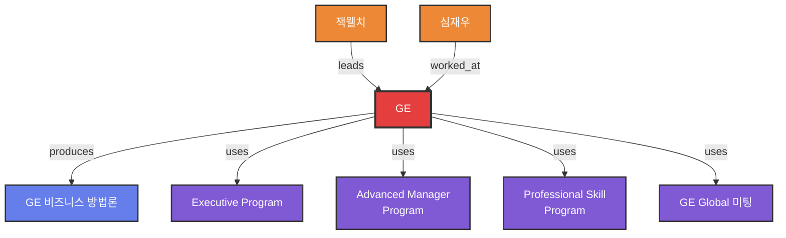

# GE (General Electric)

## 1. 한 줄 정의
세계 최고 수준의 비즈니스 프로세스와 인재 육성 시스템을 보유한 글로벌 복합기업

## 2. 핵심 요약
General Electric(GE)는 잭 웰치(Jack Welch) 회장의 리더십 아래 1980년대부터 약 15년간 2류 거대공동기업에서 세계 최우량기업으로 변모한 기업입니다.

**핵심 강점**:
- 체계적인 비즈니스 프로세스
- 세계 최고 수준의 인재 육성 시스템
- 강력한 변화관리 역량
- 글로벌 미팅 문화

## 3. 주요 사업 영역
GE는 다양한 비즈니스 영역에서 활동:
- 마케팅
- 세일즈
- 기획
- 기술
- 교육
- 프로젝트 매니징 등

## 4. GE의 핵심 방법론

### 세일즈 프로세스
- **13가지 성공법칙**
- AIDAS의 법칙
- 10 Steps of Sales Process
- Boss Managing
- Customer Managing

### 변화 리더십
- **9가지 핵심 리더십**
- 위크아웃(WorkOut)
- 액션러닝(Action Learning)
- 변화리더십 파이프라인

### 인재 육성
- **4E + V 모델**
- Executive Program (경영진)
- Advanced Manager Program (고급관리자)
- Professional Skill Program (전문가)

### 역량 관리
- Threshold of Competency (비즈니스 역량의 역치)
- Half Time of Competency (역량의 반감기)

## 5. GE Global 문화
- 체계적인 글로벌 미팅 운영
- 지식 공유 문화
- 성과 중심 문화
- 지속적 학습 조직

## 6. 한국 기업에 미친 영향
한국의 많은 CEO와 리더들이 GE를 벤치마크하려 하지만:
- GE가 비즈니스 현장에서 사용하는 **실전 역량과 노하우**에 대하여 구체적이고도 자세히 밝혀 주는 자료가 부족했음
- 국내 교육도 강사 자신이 국제 비즈니스 실무 경험도 없을 뿐더러, 교육 내용과 강의 스킬도 전문가 수준이 아니기에 큰 효과를 얻지 못하는 실정

→ **이를 해결하기 위해 GE 실무 경험자인 심재우 저자가 GE 시리즈 서적을 집필**

## 7. 연결 노트
- [[잭웰치]]
- [[GE 비즈니스 방법론]]
- [[세일즈 프로세스 13가지 성공법칙]]
- [[변화리더십 101]]
- [[4E + V 인재육성모델]]
- [[위크아웃]]
- [[액션러닝]]

## 8. 원본 출처
- 서적 4 - GE의 세일즈 노트.pdf
- 서적 5 - GE의  변화리더십 101.pdf
- 서적8-GE는 어떻게 수퍼급 인재를 만드는가.pdf
- 1%위대한기업은어떻게일하는가_본문.pdf

## 9. 역사적 의의
GE는 단순한 제조 기업을 넘어서, 경영 방법론과 인재 육성 시스템의 글로벌 표준을 만들어낸 기업으로 평가받습니다.

## 10. 온톨로지 그래프

**노드 설명:**
- 🔴 **Company**: GE (중심 조직)
- 🟠 **Person**: 잭웰치, 심재우
- 🔵 **Methodology**: GE 비즈니스 방법론
- 🟣 **Process**: 3단계 교육 프로그램, GE Global 미팅

**GE의 역할:**
- 방법론 생산자 (produces)
- 교육 프로그램 운영자 (uses)
- 리더와 전문가의 활동 무대
- 글로벌 비즈니스 문화 창조
