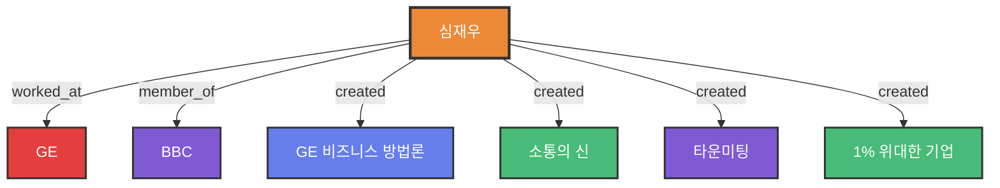

# 심재우 (Jai-Woo Shim)

## 1. 한 줄 정의
GE 글로벌 비즈니스 역량 전문가이자 비즈니스 방법론 저술가

## 2. 핵심 프로필

### 경력
- **General Electric(GE)** 글로벌 비즈니스 역량 전문가 (약 15년)
  - 마케팅 담당
  - 세일즈 담당  
  - 기획 담당
  - 기술 담당
  - 교육 담당
  - 프로젝트 매니징

### 현재 활동
- **SB 컨설팅** 대표컨설턴트
- **BBC (Biz Book Writers' Club)** 정회원
- 아주대학교 **'자기계발'** 초빙강사
- 'SB 컨설팅'의 대표컨설턴트

### 자격 및 활동
- BBC (Biz Book Writers' Club) 정회원
- 비즈니스 역량 전문가
- 기업교육 및 컨설팅

## 3. 저서 목록

### GE 시리즈
1. **GE의 세일즈 노트** (2005년 4월)
   - 부제: GE처럼 세일즈 하는 절문기술
   - 13가지 세일즈 성공법칙

2. **GE의 변화리더십 101** (2005년 11월)
   - 부제: Change Leadership 101 of GE
   - 잭 웰치의 9가지 변화리더십

3. **GE는 어떻게 수퍼급 인재를 만드는가** (2006년 7월)
   - 4E + V 인재육성 모델
   - GE 교육 프로그램 체계

### 조직 및 소통 시리즈
4. **1% 위대한 기업은 어떻게 일하는가** (2014)
   - 집단 창의성을 키우는 협업스킬 프로그램

5. **소통의 신** (2018년 10월)
   - 페이스북에서 만난 소통의 신
   - 소셜미디어 소통 방법론

6. **타운미팅** (2021년 5월)
   - 조직 소통 방법론
   - (저자교정용 1부_10부)

### 기타 저서 및 교육 컨텐츠
- 포항대 23년의 사회 경험으로 다국적기업과 대기업의 임직원들을 대상으로 책 웰치와 GE 방식의 "세일즈 철학", "커뮤니케이션", "자기계발" 등을 교육

## 4. 전문 분야

### 핵심 역량
1. **GE 비즈니스 방법론**
   - 15년간의 GE 실무 경험
   - 세일즈, 리더십, 인재육성 전문가

2. **세일즈 & 마케팅**
   - GE 세일즈 프로세스
   - 13가지 성공법칙
   - AIDAS 법칙
   - 10 Steps of Sales Process

3. **변화 리더십**
   - 9가지 핵심 리더십
   - 위크아웃
   - 액션러닝
   - 변화리더십 파이프라인

4. **인재 육성**
   - 4E + V 모델
   - 역량 기반 교육 설계
   - 리더십 개발

5. **소통 & 커뮤니케이션**
   - 소셜미디어 소통
   - 조직 소통 (타운미팅)
   - 페이스북 활용

## 5. 저술 동기 및 목적

### 문제 인식
한국의 많은 CEO와 리더들이 GE와 잭 웰치를 배우려 하나:
- GE가 비즈니스 현장에서 사용하는 **실전 역량과 노하우**에 대한 구체적 자료 부족
- 국내 비즈니스 교육의 실무 경험 및 전문성 부족
- 교육 내용과 강의 스킬이 전문가 수준에 미치지 못함

### 해결 방안
GE에서 직접 15년간 근무하면서:
- 배우고 경험했던 것들을 서술
- 내가 직접 경험한 세일즈 사례와 노하우 전달
- 프로들이 사용하는 실전 기술을 이명게 활용하는지 구체적 예시 제공
- 다양한 사례(IT, 설계 컨설팅, 제약 세일즈, 자동차 세일즈, 보험 세일즈) 실음

## 6. 집필 철학

**핵심 메시지**:
> "몇 년 전부터 우리 기업체에 참여경성 장의성을 키우는 협업스킬 프로그램"

> "우리나라의 강호 수 있는 방언이 무엇인가를 생각할 때, 세일즈를 하는 사람들 모두가 전문가적인 비즈니스 역량을 가지는 것이라 확신하였다."

> "멋년 동안 국민소득 1만불의 굴레에서 벗어나지 못하고, 어려운 경제상황에 처해 있는 우리나라의 장호 수 있는 방언이 무엇인가를 생각할 때..."

## 7. 연락처
- 휴대폰: 019-397-5734
- 이메일: forceone@dreamwiz.com

## 8. 연결 노트
- [[GE 비즈니스 방법론]]
- [[잭웰치]]
- [[GE (General Electric)]]
- [[세일즈 프로세스 13가지 성공법칙]]
- [[변화리더십 101]]
- [[4E + V 인재육성모델]]
- [[소통의 신]]

## 9. 원본 출처
- 모든 저서의 저자 소개 페이지
- 서적 4 - GE의 세일즈 노트.pdf: page 2
- 서적 5 - GE의  변화리더십 101.pdf: page 4
- 기타 저서들의 저자 정보

## 10. 평가 및 의의
심재우 저자는 GE에서의 15년 실무 경험을 바탕으로, 한국 기업들이 실제로 적용할 수 있는 GE 방법론을 구체적으로 소개한 최초의 국내 저술가로 평가받습니다.

## 11. 온톨로지 그래프

**노드 설명:**
- 🟠 **Person**: 심재우 (저자/전문가)
- 🔴 **Company**: GE
- 🟣 **Organization**: BBC
- 🔵 **Methodology**: GE 비즈니스 방법론
- 🟢 **Concept**: 소통의 신, 1% 위대한 기업
- 🟣 **Process**: 타운미팅

**저자의 기여:**
- GE 15년 실무 경험
- 6권의 비즈니스 서적 저술
- BBC 정회원 활동
- SB 컨설팅 대표
- 한국 기업을 위한 GE 방법론 번역 및 적용
