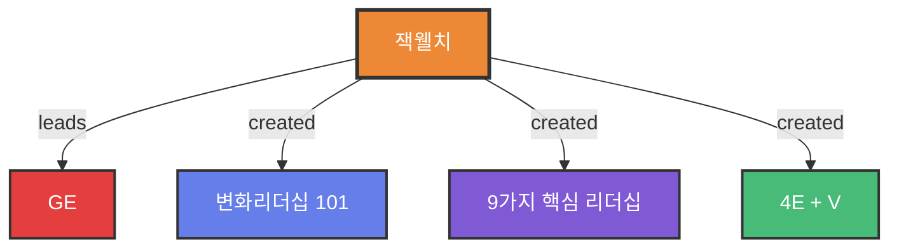

# 잭 웰치 (Jack Welch)

## 1. 한 줄 정의
GE를 세계 최고의 기업으로 만든 전설적 CEO이자 변화 리더십의 아이콘

## 2. 핵심 요약
**재임 기간**: 1980년 GE 회장 취임 → 약 15년간 재임

**주요 업적**:
- 당시 2류의 거대공동기업인 GE를 약 15년 만에 최우량기업으로 변화
- 회장이 된 이후, 가장 역점을 두고 강조하고 수진한 것이 바로 **변화(Change)**
- 세계에서 가장 강한 조직 구축
- 변화 리더십의 표본 확립

## 3. 주요 업적 및 기여

### 변화 리더십
- **GE 변화의 핵심**: 위크아웃(WorkOut)과 액션러닝(Action Learning)
- 변화리더십 파이프라인 구축
- 9가지 핵심 리더십 자질 체계화

### 인재 육성 시스템
- 4E + V 모델 확립
- 3단계 교육 프로그램 운영
  - Executive Program
  - Advanced Manager Program
  - Professional Skill Program

### 비즈니스 프로세스
- 체계적인 세일즈 프로세스 구축
- GE Global 미팅 문화 정립
- Boss Managing / Customer Managing 방법론

## 4. 리더십 철학
**변화에 대한 철학**:
- "변화하지 않으면 죽는다"
- 지속적 혁신과 개선
- 직원들의 역량 개발에 대한 집중 투자

**인재관**:
- 역량 중심의 인재 평가
- 지속적 학습과 성장 강조
- 성과와 가치의 균형

## 5. 영향력
**한국 기업계에 미친 영향**:
- 한국의 많은 CEO와 리더들이 GE와 잭 웰치를 배우려 함
- GE 방법론이 한국 기업 교육의 벤치마크가 됨
- 변화관리와 리더십 개발의 표준 모델로 인식

## 6. 관련 개념 및 방법론
- [[GE 비즈니스 방법론]]
- [[변화 리더십 101]]
- [[4E + V]]
- [[위크아웃]]
- [[액션러닝]]
- [[변화리더십 파이프라인]]

## 7. 원본 출처
- 서적 4 - GE의 세일즈 노트.pdf
- 서적 5 - GE의  변화리더십 101.pdf
- 서적8-GE는 어떻게 수퍼급 인재를 만드는가.pdf

## 8. 참고 사항
잭 웰치의 리더십과 GE 경영 방식은 전 세계 경영자들의 벤치마크가 되었으며, 특히 변화관리, 인재육성, 성과관리 분야에서 혁신적인 모델을 제시했습니다.

## 9. 온톨로지 그래프

**노드 설명:**
- 🟠 **Person**: 잭웰치 (중심 인물)
- 🔴 **Company**: GE
- 🔵 **Methodology**: 변화리더십 101
- 🟣 **Framework**: 9가지 핵심 리더십
- 🟢 **Concept**: 4E + V

**주요 기여:**
- GE CEO로서 조직 혁신
- 변화리더십 방법론 창시
- 9가지 리더십 자질 체계화
- 4E+V 인재육성 모델 개발
